# 🐸 Flexbox Froggy  


## 🧩 This file contains the solutions for solving all the levels.

---

### ⭐ Level 1

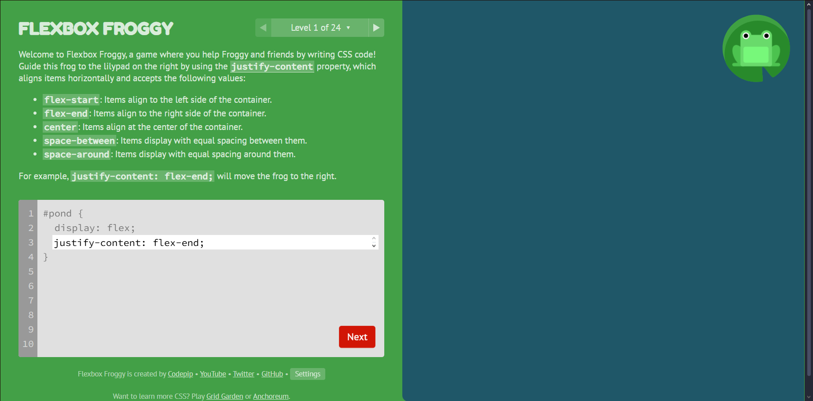

🚨`justify-content: flex-end;`

---

### ⭐ Level 2

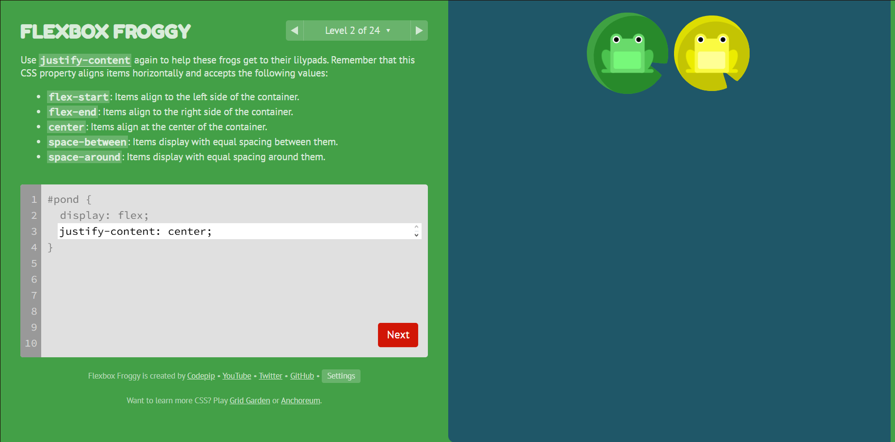

🚨`justify-content: center;`

---

### ⭐ Level 3


🚨`justify-content: space-around;`

---

### ⭐ Level 4

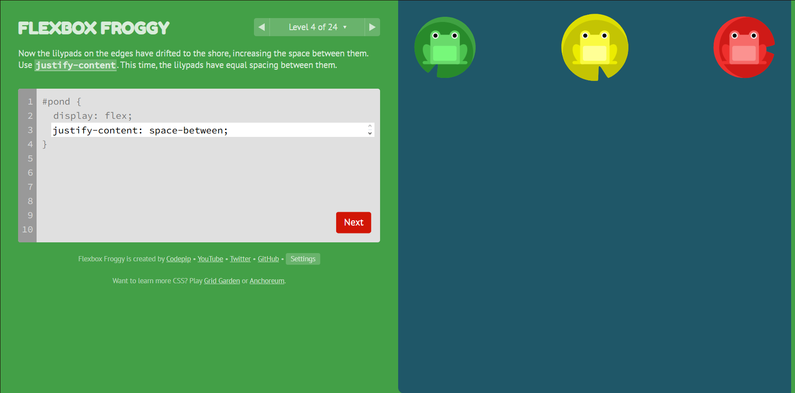

🚨`justify-content: space-between;`

---

### ⭐ Level 5

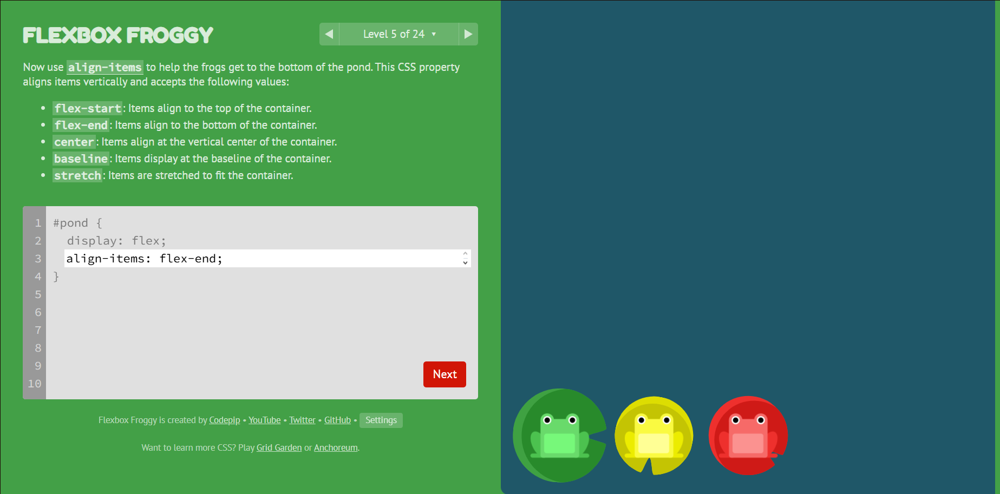

🚨`align-items: flex-end;`

---

### ⭐ Level 6


🚨
```css
justify-content: center;
align-items: center;
```
---

### ⭐ Level 7

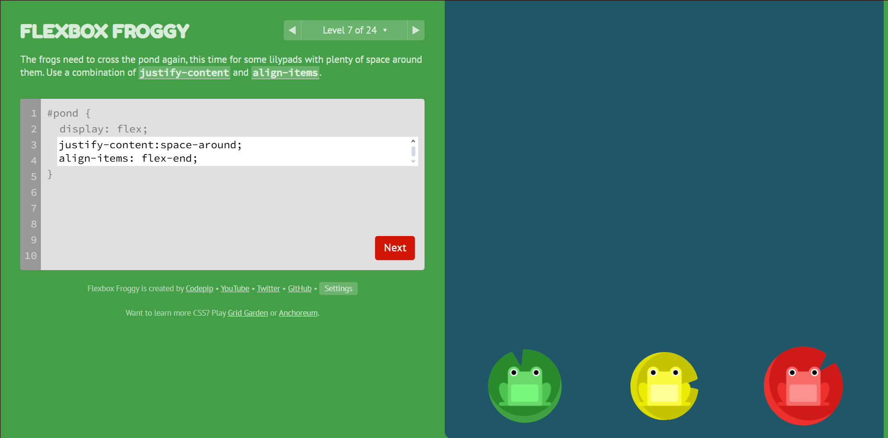

🚨
```css
justify-content: space-around;
align-items: flex-end;
```
---

### ⭐ Level 8

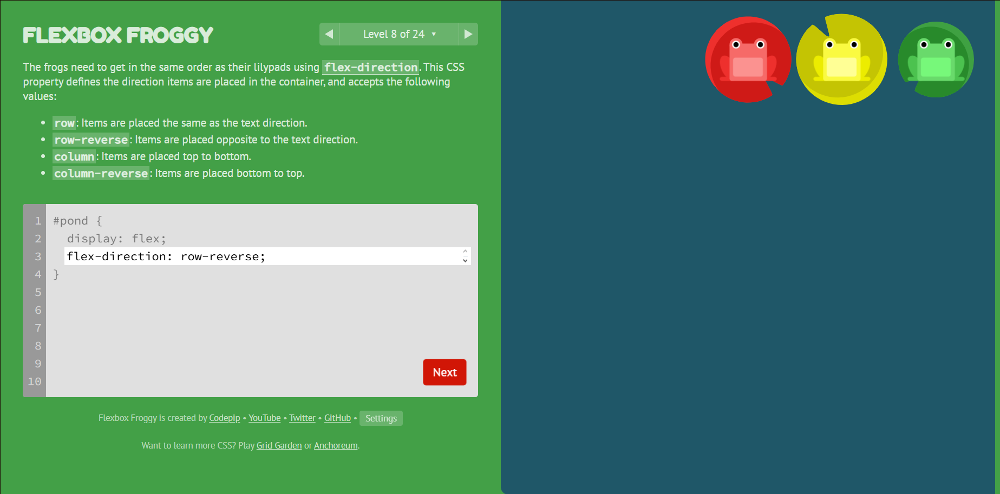

🚨`flex-direction: row-reverse;`

---

### ⭐ Level 9


🚨`flex-direction: column;`

---

### ⭐ Level 10

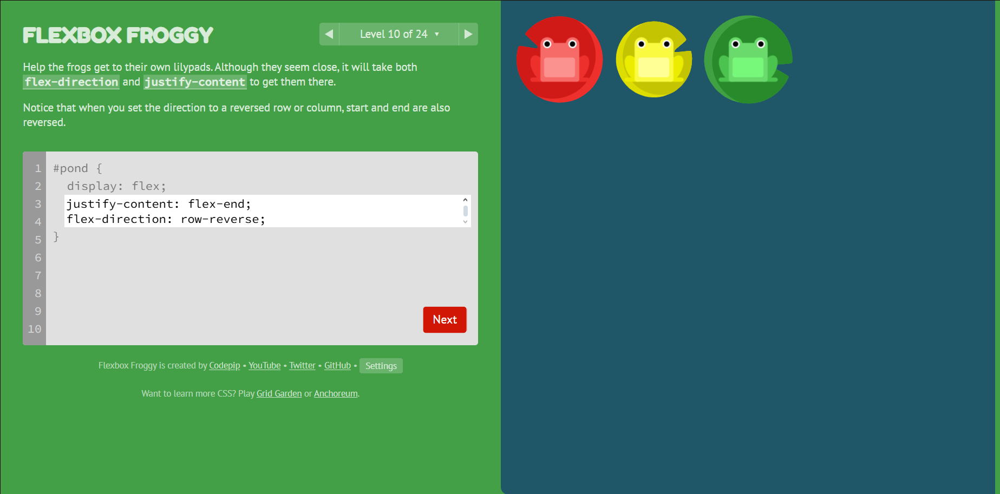

🚨
```css
justify-content: flex-end;
flex-direction: row-reverse;
```
---

### ⭐ Level 11

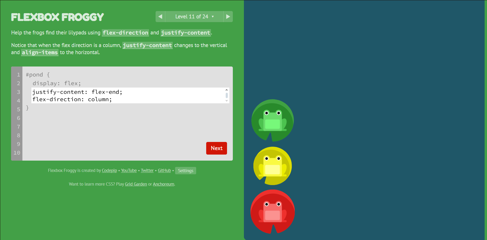

🚨
```css
justify-content: flex-end;
flex-direction: column;
```
---

### ⭐ Level 12


🚨
```css
flex-direction: column-reverse;
justify-content: space-between;
```
---

### ⭐ Level 13

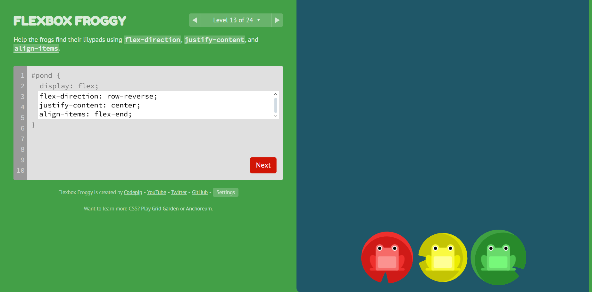

🚨
```css
flex-direction: row-reverse;
justify-content: center;
align-items: flex-end;
```
---

### ⭐ Level 14


🚨`order: 1;`

---

### ⭐ Level 15

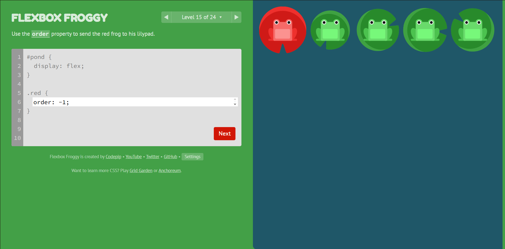

🚨`order: -1;`

---

### ⭐ Level 16


🚨`align-self: flex-end;`

---

### ⭐ Level 17

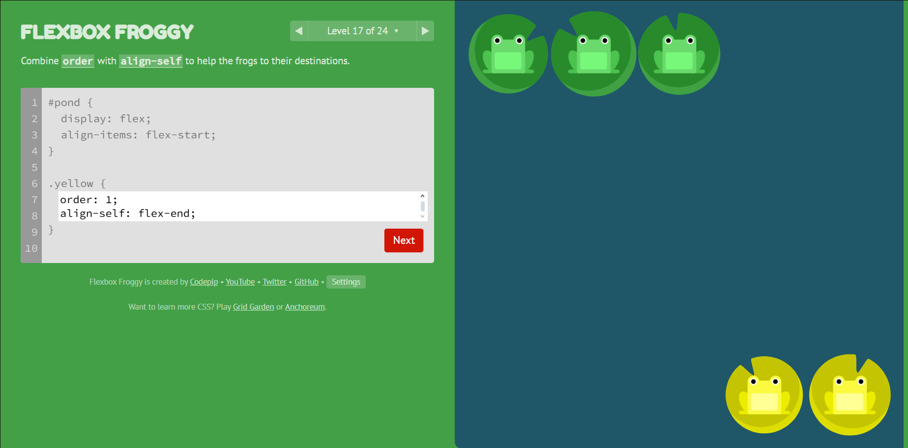

🚨
```css
order: 1;
align-self: flex-end;
```

---

### ⭐ Level 18

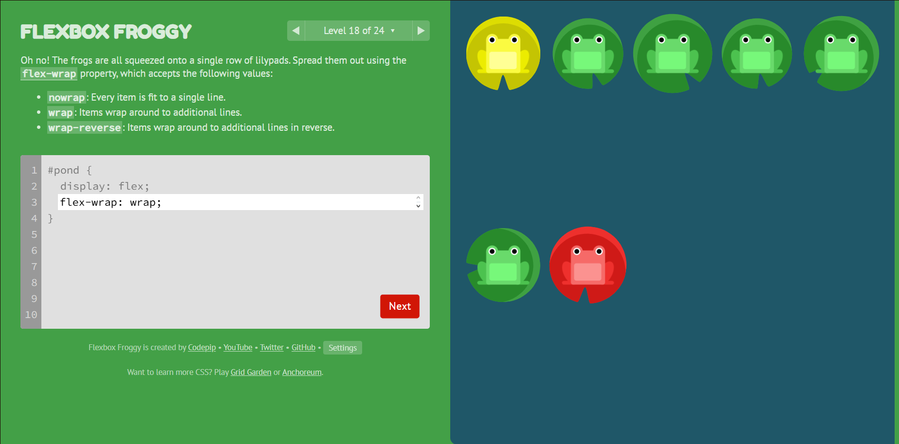

🚨`flex-wrap: wrap;`

---

### ⭐ Level 19


🚨
```css
flex-direction: column;
flex-wrap: wrap;
```

---

### ⭐ Level 20

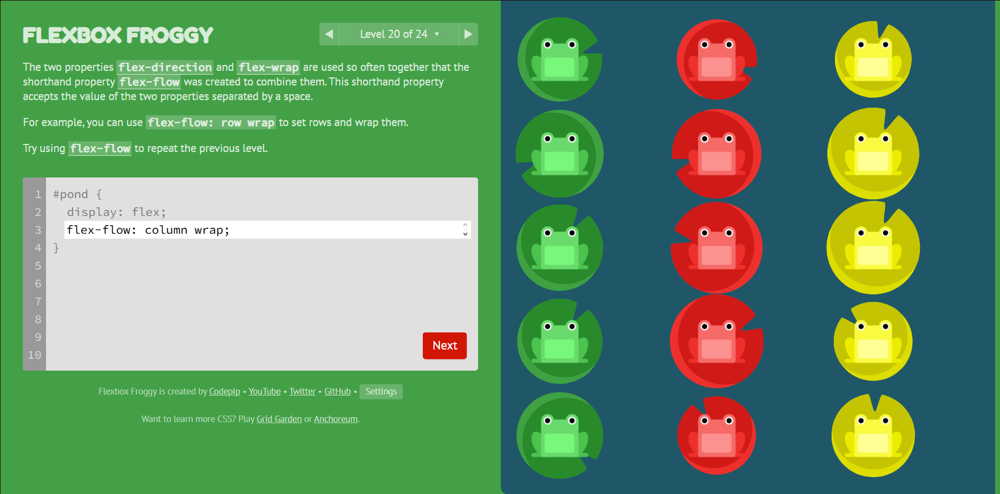

🚨`flex-flow: column wrap;`

---

### ⭐ Level 21

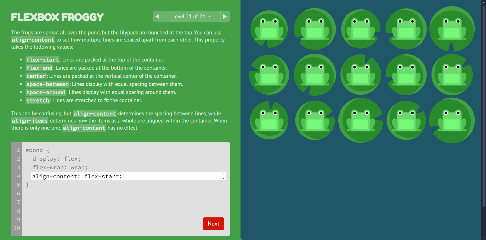

🚨`align-content: flex-start;`

---

### ⭐ Level 22

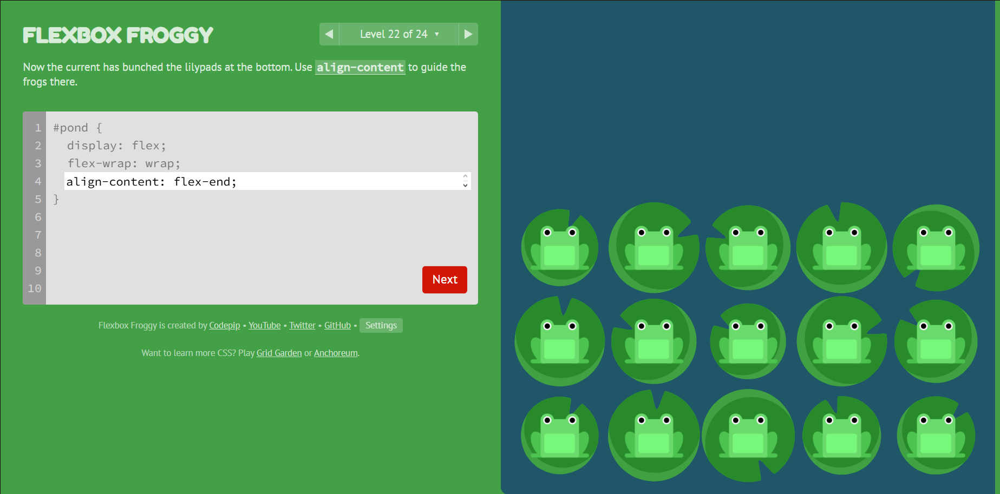

🚨`align-content: flex-end;`

---

### ⭐ Level 23


🚨
```css
flex-direction: column-reverse;
align-content: center;
```

---

### ⭐ Level 24


🚨
```css
flex-flow: column wrap-reverse;
justify-content: center;
align-content: space-between;
flex-direction: column-reverse;
```

---
