# 🥕 Grid Garden Solutions
===

## 🧩 This file contains the solutions for solving all the levels.

---

### ⭐ Level 1

🚨`grid-column-start: 3;`

---

### ⭐ Level 2

🚨`grid-column-start: 5;`

---

### ⭐ Level 3

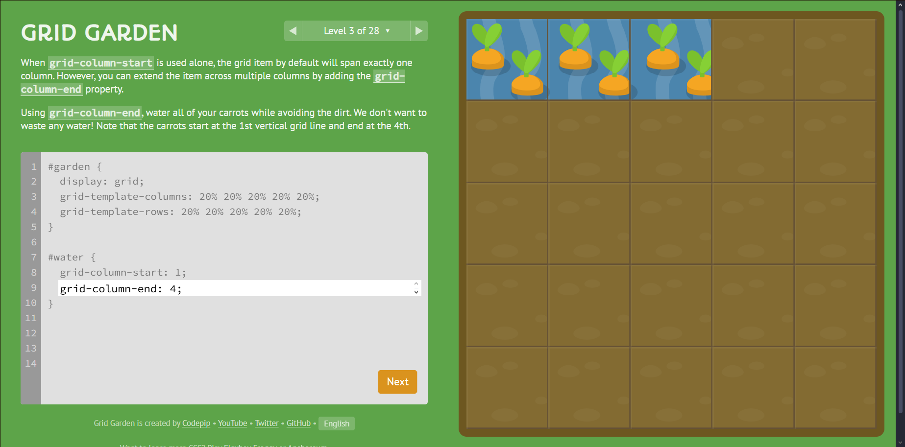

🚨`grid-column-end: 4;`

---

### ⭐ Level 4

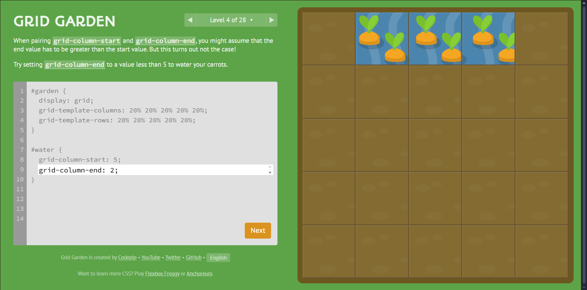

🚨`grid-column-end: 2;`

---

### ⭐ Level 5

🚨`grid-column-end: 5;`

---

### ⭐ Level 6

🚨`grid-column-start: 4;`

---

### ⭐ Level 7

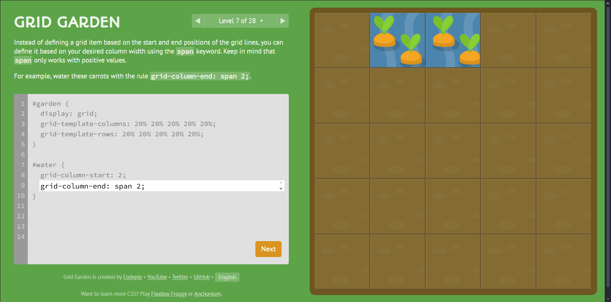

🚨`grid-column-end: span 2;`

---

### ⭐ Level 8

🚨`grid-column-end: span 5;`

---

### ⭐ Level 9

🚨`grid-column-start: 3;`

---

### ⭐ Level 10

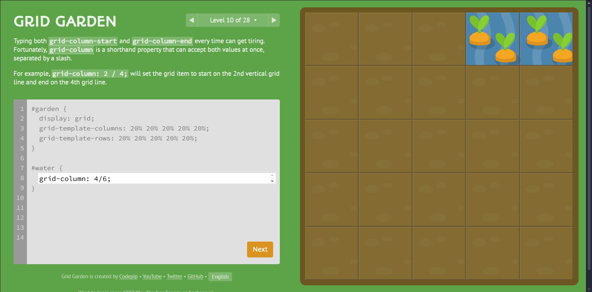

🚨`grid-column: 4/6;`

---

### ⭐ Level 11

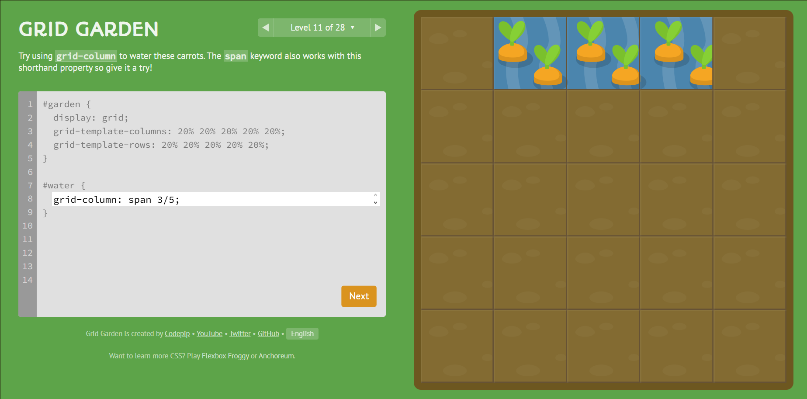

🚨`grid-column: span 3/5;`

---

### ⭐ Level 12

🚨`grid-row-start: 3;`

---

### ⭐ Level 13

🚨`grid-row: 3/6;`

---

### ⭐ Level 14

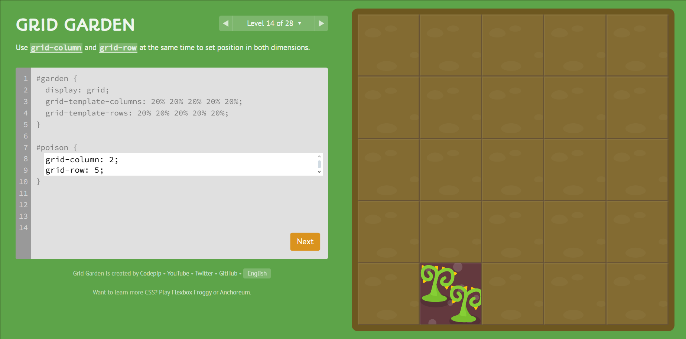

🚨`grid-column: 2;
 grid-row: 5;`

---

### ⭐ Level 15

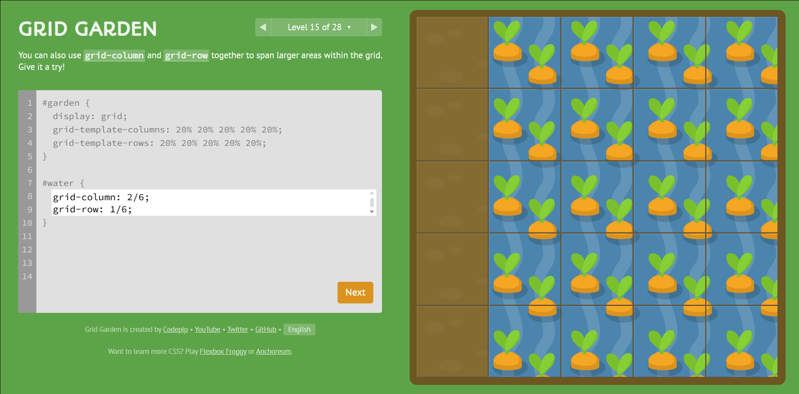

🚨`grid-column: 2/6;
 grid-row: 1/6;`

---

### ⭐ Level 16

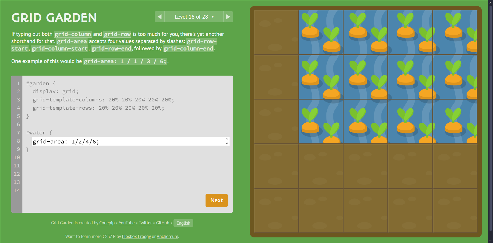

🚨`grid-area: 1/2/4/6;`

---

### ⭐ Level 17

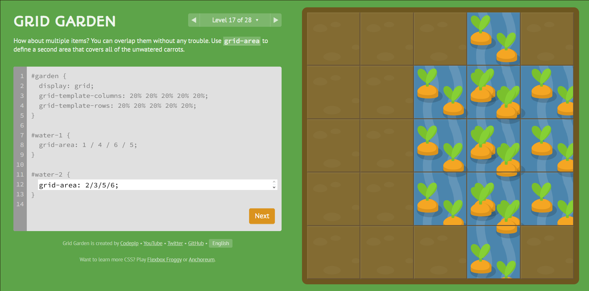

🚨`grid-area: 2/3/5/6;`

---

### ⭐ Level 18

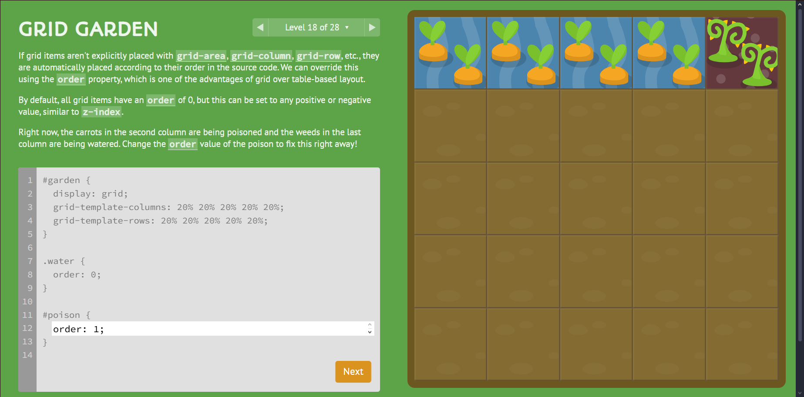

🚨`order: 1;`

---

### ⭐ Level 19

🚨`order: -1;`

---

### ⭐ Level 20

🚨`grid-template-columns: 50%;`

---

### ⭐ Level 21

🚨`grid-template-columns: repeat(8, 12.5%);`

---

### ⭐ Level 22

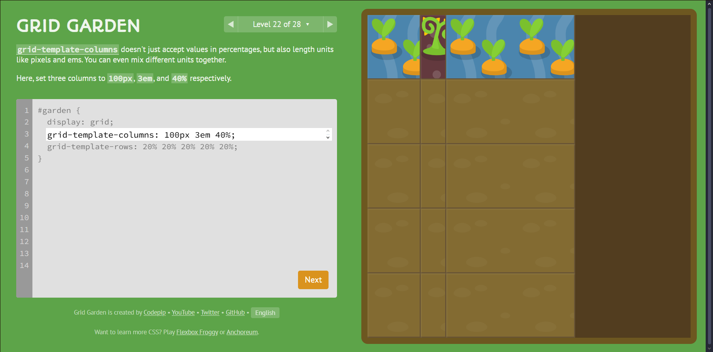

🚨`grid-template-columns: 100px 3em 40%;`

---

### ⭐ Level 23

🚨`grid-template-columns: 1fr 5fr;`

---

### ⭐ Level 24

🚨`grid-template-columns: 50px 1fr 1fr 1fr 50px;`

---

### ⭐ Level 25

🚨`grid-template-columns: 75px 3fr 2fr;`

---

### ⭐ Level 26

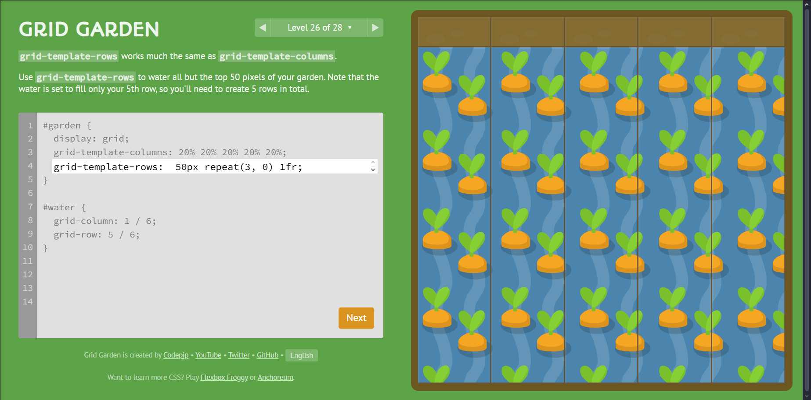

🚨`grid-template-rows: 50px repeat(3, 0) 1fr;`

---

### ⭐ Level 27

🚨`grid-template: 60% 40% /200px;`

---

### ⭐ Level 28

🚨`grid-template: 1fr 50px / 20% 1fr;`

---
